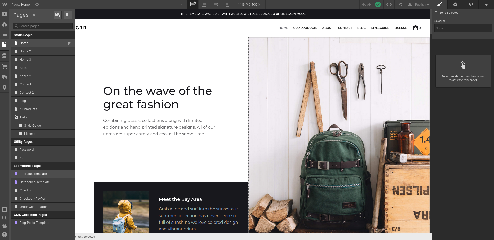

Any eCommerce theme in Webflow is convertible without any structure limitation in terms of number of pages.

The Adapter automatically understands your page structure and creates the Shopify pages according to your theme. 

All static pages are automatically created as static page in Shopify, and all dynamic pages are mapped either as eCommerce pages or Blog pages.

You can slightly modify this behaviour just using a different page slug that you can change in Webflow. 

Just as a reminder, the **page slug** is the user friendly and URL valid name of your page in Webflow. Inside slugs you can not use spaces, accented characters, special characters or uppercase characters. You can modify your page slug, inside page settings under the name **Slug**

You will find how to define relevant pages in next sections, divided by context, but most of the times you will not need to do any modification to your theme structure, unless you need some specific functions.

## Example Structure

To do a simple recap and example of how this works, 

Let's start from a free [Webflow template](https://webflow.com/templates/html/grit-fashion-website-template) and let's analyze how 

and let's see how this structure will translate in Shopify

### Utility pages

All utility pages are used with same purpose also in 

1. **Password Page** will be used if your store is password protected;
2. **404** page will be used as page not found;
3. **Search Page** will be used as a page to show

### E-Commerce Pages

1. **Products Template** will be used as the page to shows your single product ;
2. **Categories Template** will be used as the page that shows all products of a *specific collection*;
3. **Checkout**, will be deleted, Shopify doesn't allow you to modify the checkout layout;
4. **Checkout (Paypal)**,  will be deleted, Shopify doesn't allow you to modify the checkout layout;
5. **Order Confirmation** will be used to show the details of an *Order*;

More details about E-Commerce and pages can be found on the E-Commerce section.

### CMS Collection Pages

Since in Shopify, actually you can't create "Custom CMS Collections", the adapter translates all different CMS Collections as different *Blogs*, so every page that you can find inside the section **CMS Collection Pages**, will be converted as an *alternative article template*.

For example if you create a CMS collection called **Event** in Webflow, you will find all single events inside the url structure /blogs/event/event-slug, and this url will use the page **Event Template** that you find under *CMS Collection Pages*.

More details about CMS Collections and pages can be found on this section.

### Static Pages

All static pages will be converted as static pages as well, unless they have a reserved **page slug** or use a reserved **page slug pattern**.

Note that all the pages below are optional, but can surely enhance your Shopify theme!

Below you can find a list of reserved page slugs or page slugs patterns, divided by context:

#### E-Commerce

1. **cart**: used to create the template showed at the url: `/cart`;
2. **gift-card**: used to create a **Gift Card** Page. this page will be accessible only through email links; 
3. **list-collections**: used to create the template showed at the the url `/collections`;
4. **collection-all**: used to create the template showed at the url `/collections/all` (Formerly this is the Shop page in Shopify);
5. **collection-***: used to create an alternative collection template;
6. **product-***: used to create an alternative product template;

#### Account

1. **login**: used to create the template showed at the url `/customers/login`;
2. **register**: used to create the template showed at the url `/customers/register`;
3. **account**: used to create the template showed at the url `/customers/account`;
4. **activate** or **activate-account**: used to create an **Activate Account** page, that is accessible only through email links;
5. **reset**: used to create the template showed at the url `/customers/reset-password`;
6. **addresses**: used to create the template showed at the url `/customers/addresses`;

#### CMS Collections

1. **blog-***: used to create an alternative blog template;
2. **article-**: used to create an alternative article template;

#### Page Templates

1. **page** or **default**: used to create a default page template, useful to create pages directly in Shopify;
2. **special-page**: used for policy pages and some special third party apps;

